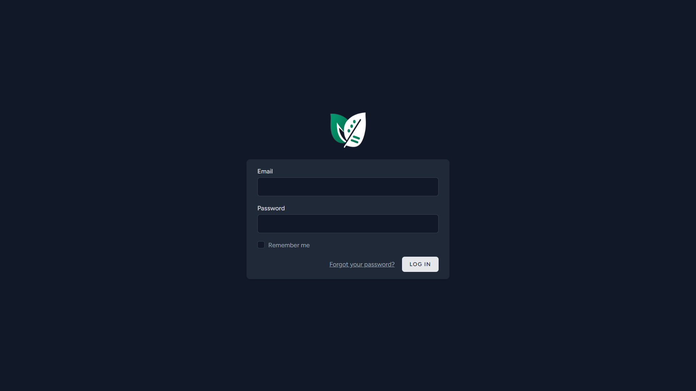
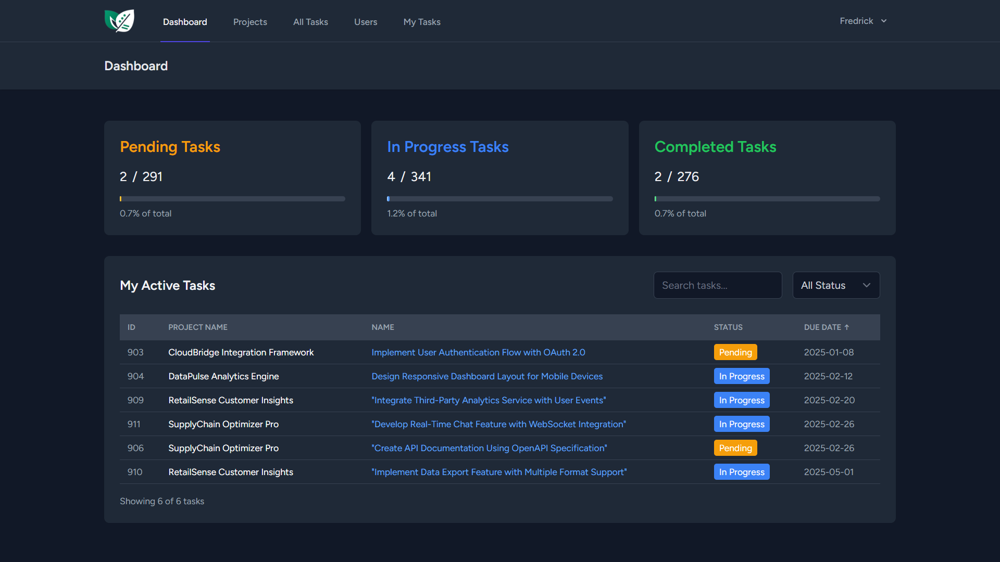
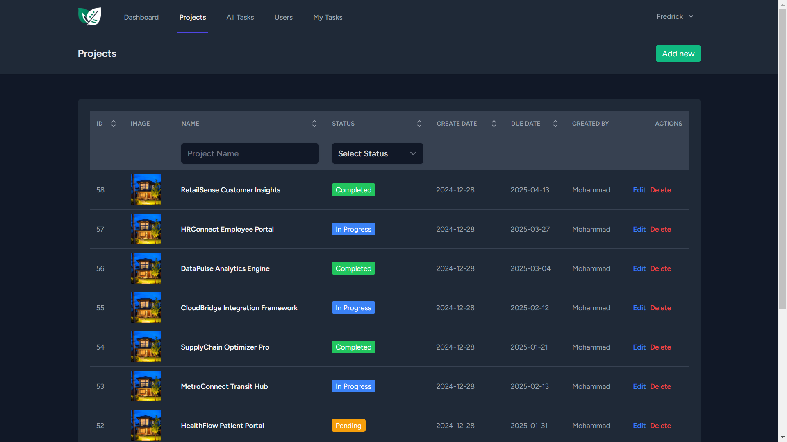
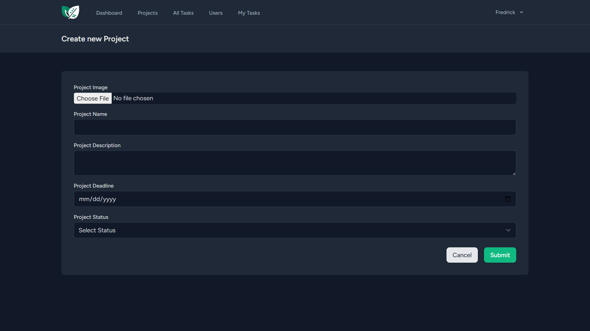
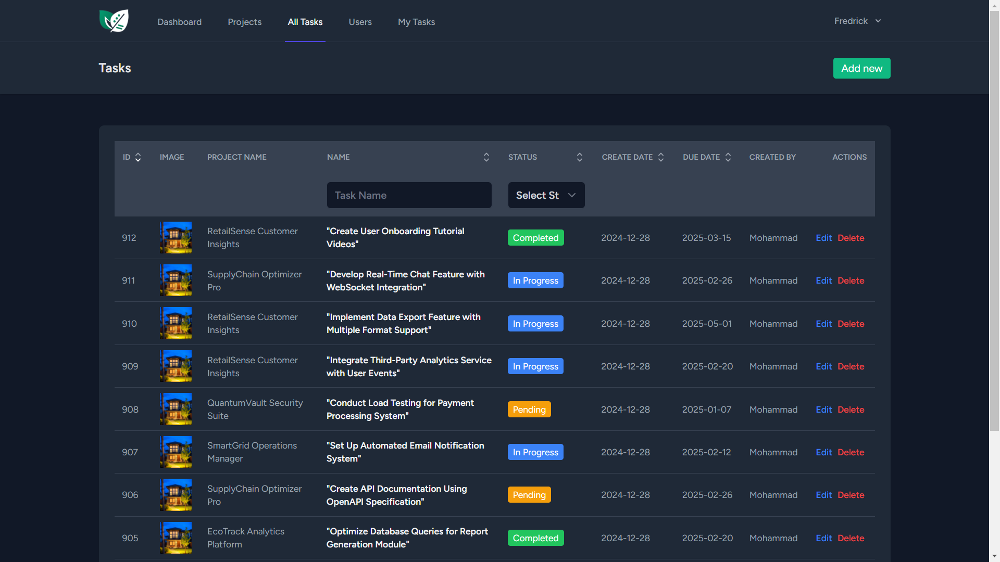
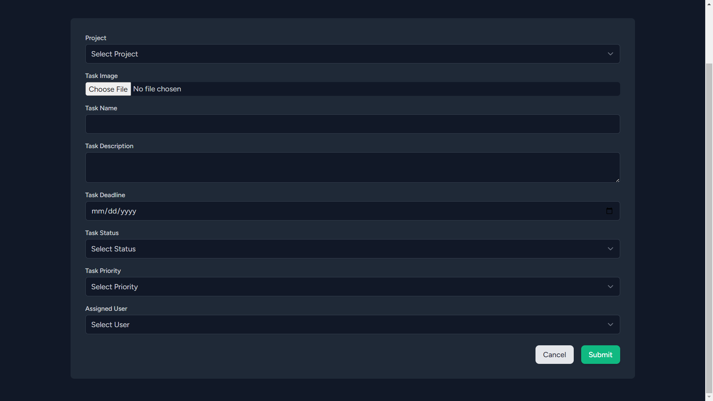
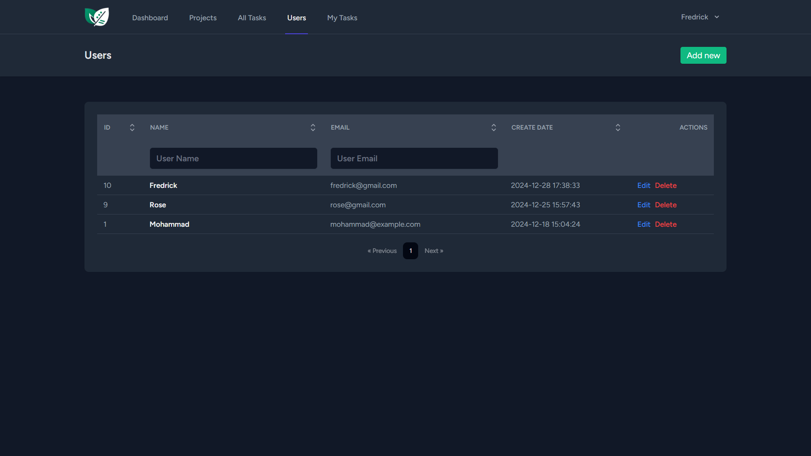
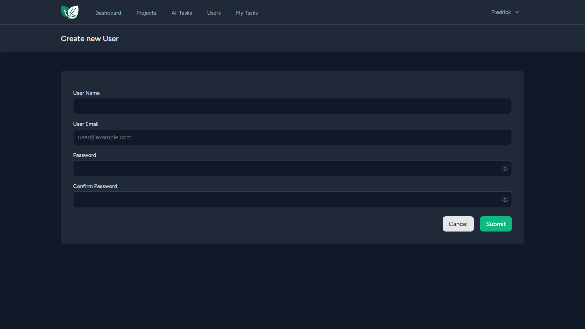

<div align="center">


# **ManageMint**

### A modern, full-stack project management solution built for teams that move fast.

[](https://opensource.org/licenses/MIT)
[](https://laravel.com)
[](https://reactjs.org)
[](https://tailwindcss.com)
[](https://inertiajs.com)


</div>

---

## 🚀 **Overview**

ManageMint revolutionizes project management by combining powerful features with an intuitive interface. Built for teams of all sizes, it streamlines collaboration while providing robust tools for project tracking and coordination.

### **Why Choose ManageMint?**

- 🎯 **Intuitive Interface**: Get started in minutes with our user-friendly design.
- ⚡ **Real-Time Updates**: Stay synchronized with instant notifications and live updates.
- 🛠️ **Customizable Workflows**: Tailor the system to match your team's unique processes.
- 📱 **Responsive Design**: Seamlessly access projects across all devices.
- 🔒 **Enterprise-Grade Security**: Built with security best practices at its core.

---

## ✨ **Key Features**

### **Project Management**
- Create, update, and delete projects.
- Add descriptions, images, deadlines, and statuses.
- Assign projects to team members.

### **Task Management**
- Create, edit, and delete tasks.
- Associate tasks with projects and users.
- Add descriptions, deadlines, priorities, statuses, and images.

### **Team Collaboration**
- Individualized task assignments.
- Shared calendars and milestones.
- Multiple users can collaborate on the same project.

### **Integration & APIs**
- RESTful API with extensive documentation.
- Single Sign-On (SSO) capabilities.
- Export data in multiple formats.
- Third-party app integrations.

---

## 🛠️ **Technology Stack**

### **Backend**
- **Framework**: Laravel 11
- **Database**: MySQL 8.0+

### **Frontend**
- **Framework**: React 18
- **Styling**: Tailwind CSS 3
- **State Management**: Redux Toolkit
- **Forms**: React Hook Form

### **Infrastructure**
- **Routing**: Inertia.js
- **Testing**: PHPUnit & Jest
- **CI/CD**: GitHub Actions

---

## 📦 **Installation**

### **Prerequisites**

Ensure the following tools are installed:
- PHP >= 8.1
- Composer >= 2.0
- Node.js >= 16
- MySQL >= 8.0 (or PostgreSQL >= 13)
- Redis >= 6.0 (optional for caching)

### **Quick Start**

1. **Clone & Install Dependencies**
   ```bash
   git clone https://github.com/mohamad-abdelkhalek/ManageMint.git
   cd ManageMint

   # Install PHP dependencies
   composer install

   # Install Node.js dependencies
   npm install
   ```

2. **Environment Setup**
   ```bash
   # Copy environment file
   cp .env.example .env

   # Generate application key
   php artisan key:generate

   # Update database credentials in .env
   ```

3. **Database & Storage Setup**
   ```bash
   # Run migrations
   php artisan migrate

   # Seed the database (optional)
   php artisan db:seed

   # Link storage
   php artisan storage:link
   ```

4. **Start Development Servers**
   ```bash
   # Start Laravel server
   php artisan serve

   # Start Vite development server
   npm run dev
   ```

Visit `http://localhost:8000` to access the application.


---

## 📖 **Documentation**


- Getting Started Guide
- API Documentation
- Configuration Options
- Deployment Strategies
- Security Best Practices
- Troubleshooting Guide

---

## 🖼️ **Screenshots**

### **Authentication**

*Secure and streamlined login experience.*

### **Dashboard**

*Customizable overview with project metrics.*

### **Projects**

*Manage and organize projects effectively.*

### **Create New Project**

*Create new projects effectively.*

### **Tasks**

*Comprehensive task management interface.*

### **Create New Task**

*Create new tasks effectively.*

### **Users**

*Easily manage team members.*

### **Add New Users**

*Easily add new team members.*

---

## 🤝 **Contributing**

We love contributions!

- Reporting bugs
- Suggesting features
- Writing documentation
- Submitting pull requests

---

<div align="center">

Made with ❤️ by the developer Mohammad Abdelkhalek

[**GitHub**](https://github.com/mohamad-abdelkhalek)

</div>
