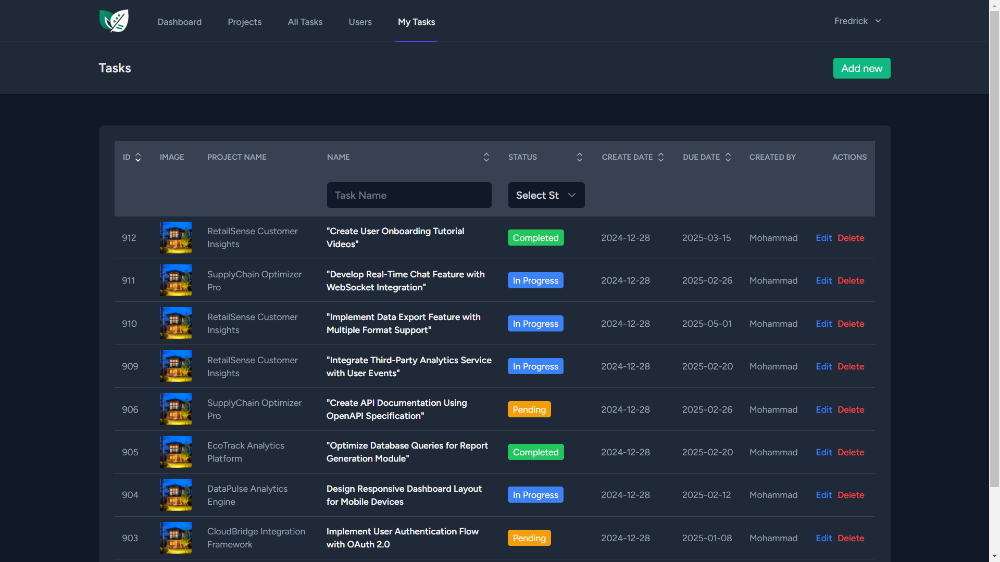

# ManageMint

<div align="center">


A modern, full-stack project management solution built for teams that move fast.

[](https://opensource.org/licenses/MIT)
[](https://laravel.com)
[](https://reactjs.org)
[](https://tailwindcss.com)
[](https://inertiajs.com)

[Demo](https://demo.managemint.dev) • [Documentation](https://docs.managemint.dev) • [Report Bug](https://github.com/yourusername/managemint/issues) • [Request Feature](https://github.com/yourusername/managemint/issues)

</div>

## 🚀 Overview

ManageMint revolutionizes project management by combining powerful features with an intuitive interface. Perfect for teams of all sizes, it streamlines collaboration while providing robust tools for project tracking and team coordination.

### Why ManageMint?

- 🎯 **Intuitive Interface**: Get started in minutes with our user-friendly design
- ⚡ **Real-Time Updates**: Stay synchronized with instant notifications and live updates
- 🛠️ **Customizable Workflows**: Adapt the system to match your team's unique processes
- 📱 **Responsive Design**: Access your projects seamlessly across all devices
- 🔒 **Enterprise-Grade Security**: Built with security best practices at its core

## ✨ Key Features

### Project Management
- Hierarchical project organization with unlimited nesting
- Custom project templates and workflows
- Rich text documentation with markdown support
- File attachments and version control
- Project analytics and reporting

### Task Management
- Drag-and-drop task prioritization
- Custom task statuses and labels
- Time tracking and estimation
- Dependencies and subtasks
- Bulk task operations

### Team Collaboration
- Role-based access control
- Team chat and discussions
- @mentions and notifications
- Activity logs and audit trails
- Shared calendars and milestones

### Integration & APIs
- RESTful API with comprehensive documentation
- Webhook support for custom integrations
- Single Sign-On (SSO) capabilities
- Export data in multiple formats
- Third-party app integrations

## 🛠️ Technology Stack

### Backend
- **Framework**: Laravel 11
- **Database**: MySQL 8.0+
- **Caching**: Redis
- **Search**: Meilisearch
- **Queue**: Laravel Horizon

### Frontend
- **Framework**: React 18
- **Styling**: Tailwind CSS 3
- **State Management**: Redux Toolkit
- **Forms**: React Hook Form
- **Data Fetching**: TanStack Query

### Infrastructure
- **Routing**: Inertia.js
- **Real-time**: Laravel WebSockets
- **Authentication**: Laravel Sanctum
- **Testing**: PHPUnit & Jest
- **CI/CD**: GitHub Actions

## 📦 Installation

### Prerequisites

Ensure you have the following installed:
- PHP >= 8.1
- Composer >= 2.0
- Node.js >= 16
- MySQL >= 8.0 or PostgreSQL >= 13
- Redis >= 6.0 (optional, for caching)

### Quick Start

1. **Clone & Install Dependencies**
   ```bash
   # Clone the repository
   git clone https://github.com/yourusername/managemint.git
   cd managemint

   # Install PHP dependencies
   composer install

   # Install Node.js dependencies
   npm install
   ```

2. **Environment Setup**
   ```bash
   # Copy environment file
   cp .env.example .env

   # Generate application key
   php artisan key:generate

   # Configure your .env file
   # Update database credentials and other settings
   ```

3. **Database & Storage Setup**
   ```bash
   # Run migrations
   php artisan migrate

   # Seed the database (optional)
   php artisan db:seed

   # Link storage
   php artisan storage:link
   ```

4. **Start Development Servers**
   ```bash
   # Start Laravel server
   php artisan serve

   # Start Vite development server
   npm run dev
   ```

Visit `http://localhost:8000` to access the application.

### Production Deployment

For production deployment instructions, see our [deployment guide](docs/deployment.md).

## 📖 Documentation

Comprehensive documentation is available at [docs.managemint.dev](https://docs.managemint.dev), including:

- Getting Started Guide
- API Documentation
- Configuration Options
- Deployment Strategies
- Security Best Practices
- Troubleshooting Guide


## 🖼️ Screenshots

Here's a comprehensive look at ManageMint's interface and features:

### Authentication

*Secure and streamlined login experience*

### Dashboard & Overview

*Customizable dashboard with project metrics and task overview*

### Project Management

*Project listing and management interface*


*Intuitive project creation workflow*

### Task Management

*Complete task management interface with filtering and sorting*


*Detailed task creation form with all necessary fields*


*Personal task dashboard for individual productivity*

### User Management

*Team member management and role assignment*


*User onboarding and permission configuration*


## 🤝 Contributing

We love contributions! See our [Contributing Guide](CONTRIBUTING.md) for ways to get started. This includes:

- Reporting bugs
- Suggesting enhancements
- Writing documentation
- Submitting pull requests

Please read our [Code of Conduct](CODE_OF_CONDUCT.md) before contributing.

## 📄 License

ManageMint is open-source software licensed under the [MIT license](LICENSE). Feel free to use it for personal or commercial projects.

## 💪 Support

- Join our [Discord community](https://discord.gg/managemint)
- Follow us on [Twitter](https://twitter.com/managemint)
- Email support: support@managemint.dev

---

<div align="center">

Made with ❤️ by the ManageMint Team

[Website](https://managemint.dev) • [Blog](https://blog.managemint.dev) • [Roadmap](https://github.com/yourusername/managemint/projects)

</div>
